## Hi there 👋

My name is Gabriele Santandrea (**Gab-San**).

Here are some ideas to get you started:

- 🌱 I’m currently a student of HPC Engineering at [Politecnico di Milano]("https://www.polimi.it/")
- 📫 How to reach me: 
- 😄 Pronouns: he/him
- ⚡ Fun fact: I am lactose intolerant and my friends call me **Gamba di Squalo** (_Shark's Leg_).

Also checkout: 

---

Shout-out to [Github Stats Extended]("https://github.com/stats-organization/github-stats-extended")

Also follow these incredible people👇👇👇👇

[@Alessandro Ruzza](https://github.com/AlessandroRuzza)
[@Daniele Salvi](https://github.com/DanieleSalvi2810)
[@Federico Quartieri](https://github.com/FedericoQuartieri)
[@Giacomo Tessera](https://github.com/Tex024)
[@Riccardo Polelli](https://github.com/Pole11)
[@Aldas Lenkšas](https://github.com/Aldas25)

---

Feel free to leave a comment!👇

## 💬 Latest Comments

<!-- DISCUSSIONS-COMMENTS-START -->

2026-07-26

TEEEEST

— <a href="https://github.com/Gab-San" style="color: #58a6ff; text-decoration: none;">@Gab-San</a>

<!-- DISCUSSIONS-COMMENTS-END -->
